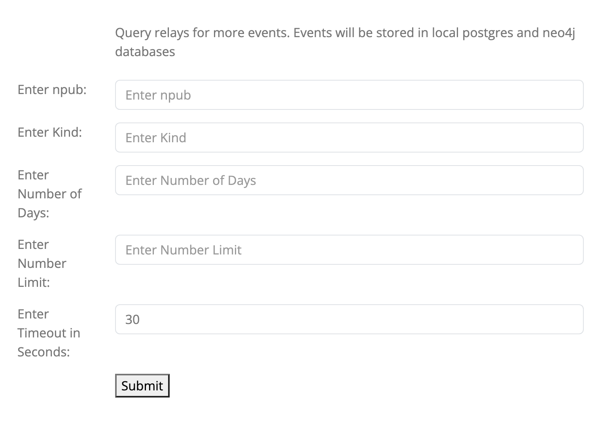

# purple-py

### Objectives

- Make it easier for developers to use nostr data by setting up databases with [nix](flake.nix), [preprocessing events](db.py), and [analyzing](pages/network.py)/[visualizing](pages/user.py) data
- Future: create new data/visualizations for use by clients and apps

### Usage

- `nix develop`: [Nix package manager](https://nixos.org/download) will install and configure local databases (postgres and neo4j)
- `python app.py`: start [plotly dash](https://dash.plotly.com/) app
- go to [`http://localhost:8050/`](http://localhost:8050/)
- The first time you start the app, the databases will be empty. Go to the [Query Relays](http://localhost:8050/relay) tab ([src](pages/relay.py)). This will query relays, parse events, and store them in the local databases.

  

- [Network](http://localhost:8050/network) tab ([src](pages/network.py)): show network-level metrics such as most active, followed, and targeted users

  

- [User](http://localhost:8050/user) tab ([src](pages/user.py)): show user-level metrics such as histogram of events created by user(broken down by kind, day of week, and hour of day) and biggest fan (user with the most mentions/reactions to those events)

  

- [Neo4j](http://localhost:8050/neo4j) tab ([src](pages/neo4j.py)): link to neo4j browser

  

### Tools

- [PostgreSQL](https://www.postgresql.org/): sql database
- [Neo4j](https://neo4j.com/): graph database for network analysis
- [Plotly Dash](https://dash.plotly.com/): python framework for interactive visualizations
- [Rust Nostr SDK](https://github.com/rust-nostr/nostr/tree/master/crates/nostr-sdk) [python bindings](https://pypi.org/project/nostr-sdk/): nostr client library
