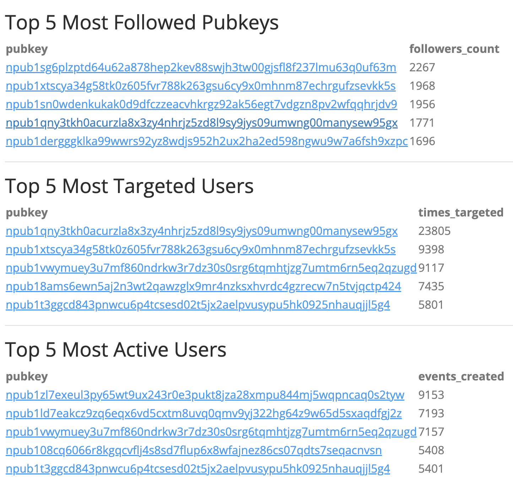
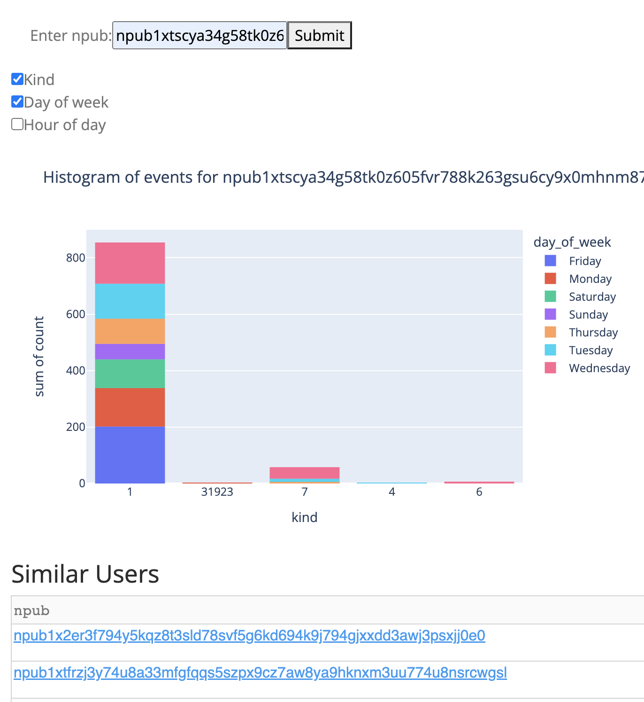
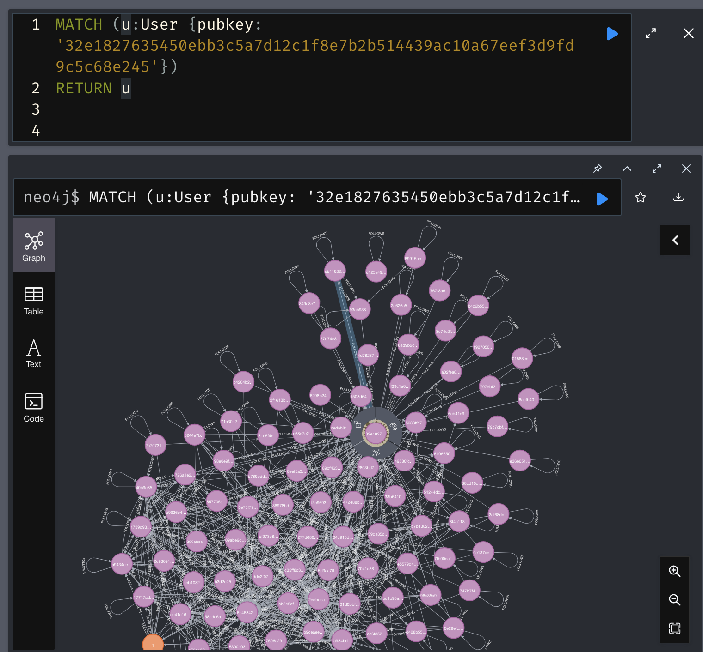

# purple-py

### Objectives

This project is a prototype app for analyzing nostr data to help with search, discovery, and onboarding.

Demo using nostr events between 2023-11-14 and 2023-11-21:[add url]

### Features
- Vectorizes data with [embeddings](langchain embeddings link) to enable semantic search across different kinds
- Uses [nix](flake.nix) to setup infrastructure to parse nostr events from [strfry](strfry) database, load into [weaviate]() and [neo4j](), and query using plotly [dash] app to create interactive visualizations with python

### Installation

- Install [Nix package manager](https://nixos.org/download) (if not already installed)
- Download nostr events using [strfry](https://github.com/hoytech/strfry/blob/master/README.md#compile)
  - instructions download (strfry router strfry-router.config)
- Export nostr events from strfry database as json (for neo4j import): `./strfry export dbdump.jsonl`

- Start weaviate docker container: `docker compose up -d`
- Create .env file with environment variables: `cp .env.example .env`
  - Make sure `STRFRY_DB_FOLDER`, `NEO4J_IMPORT_DIR` set correctly
- Run python script main.py: `python -m purple_py.main`
  - create weaviate classes
  - load events into weaviate
  - load data into neo4j
- Start dash app: `python -m purple_py.app`
- Go to browser to use app: `http://localhost:8050/`

### Usage

- `nix develop`: [Nix package manager](https://nixos.org/download) will install and configure local databases (postgres and neo4j)
- `docker compose up -d`: start weaviate container
- `python -m purple_py.main`: load events into weaviate, load events into neo4j
- `python -m purple_py.app`: start [plotly dash](https://dash.plotly.com/) app
- go to [`http://localhost:8050/`](http://localhost:8050/)
  - The home page shows a summary about the number of events for each kind [home page screenshot]
  - [Search](http://localhost:8050/search) tab ([src](pages/search.py)): find events related to search phrase using vector-based similarity
  
  - [Network](http://localhost:8050/network) tab ([src](pages/network.py)): show network-level metrics such as most active, followed, and targeted users
  
  - [User](http://localhost:8050/user) tab ([src](pages/user.py)): show user-level metrics such as histogram of events created by user (broken down by kind, day of week, and hour of day) and biggest fan (user with the most mentions/reactions to those events)
  
  - [Neo4j](http://localhost:8050/neo4j) tab ([src](pages/neo4j.py)): link to neo4j browser
  

### Tools
- [Strfry]
- [Neo4j](https://neo4j.com/): graph database for network analysis
- [Plotly Dash](https://dash.plotly.com/): python framework for interactive visualizations
- [Rust Nostr SDK](https://github.com/rust-nostr/nostr/tree/master/crates/nostr-sdk) [python bindings](https://pypi.org/project/nostr-sdk/): nostr client library

