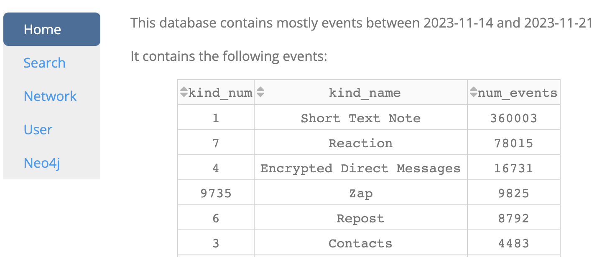

# Conduit

### Objectives

This project is a prototype app for analyzing nostr data to help with search, discovery, and onboarding.

### Live Demo
[add url] (Note: db contains mostly events from 2023-11-14 to 2023-11-21)

### Features
- Vectorizes content with [embeddings](https://www.elastic.co/what-is/vector-embedding) to enable semantic search across different kinds
- Uses [nix](flake.nix) to setup infrastructure to:
  - Parse nostr events from [strfry](strfry) database
  - Load events into vector ([weaviate](https://weaviate.io/developers/weaviate)) and graph ([neo4j](https://neo4j.com/developer/)) databases
  - Query data using plotly [dash](https://dash.plotly.com/) app with interactive python visualizations

### Usage
- Install [Nix package manager](https://nixos.org/download) to setup databases (weaviate and neo4j)
- Start nix:
  - `nix develop`
- Download nostr events using [strfry](https://github.com/hoytech/strfry/blob/master/README.md#compile)
  - Commands to download events: [router](https://github.com/hoytech/strfry/blob/master/docs/router.md), [stream](https://github.com/hoytech/strfry?tab=readme-ov-file#stream), [sync](https://github.com/hoytech/strfry?tab=readme-ov-file#sync) 
- [Export](https://github.com/hoytech/strfry?tab=readme-ov-file#exporting-data) nostr events from strfry database as json (for neo4j import):
  - `strfry export dbdump.jsonl`
- Start weaviate docker container:
  - `docker compose up -d`
- Create .env file with environment variables:
  - `cp .env.example .env`
  - Set `STRFRY_DB_FOLDER`, `NEO4J_IMPORT_DIR` to correct directories
- Start Neo4j
  - `neo4j start`
- Run python script main.py:
  - `python -m conduit.main`
  - create weaviate classes
  - load events into weaviate
  - load data into neo4j
- Start plotly dash app:
  - `python -m conduit.app`
- Go to browser to use app:
  - [`http://localhost:8050/`](http://localhost:8050/): home page summarizes the number of events in db
  
    
  - [Search](http://localhost:8050/search) tab ([src](pages/search.py)): find events related to search phrase using vector-based similarity
  
    
  - [Network](http://localhost:8050/network) tab ([src](pages/network.py)): show network-level metrics such as most active, followed, and targeted users
  
    
  - [User](http://localhost:8050/user) tab ([src](pages/user.py)): show user metrics such as histogram of created events (broken down by kind, day of week, and hour of day) and biggest fan (user with the most mentions/reactions to those events)
  
    
  - [Neo4j](http://localhost:8050/neo4j) tab ([src](pages/neo4j.py)): link to neo4j browser
  
    

### Tools/Software Used
- [Strfry](https://github.com/hoytech/strfry/): nostr relay
- [Weaviate](https://weaviate.io): vector database
- [Neo4j](https://neo4j.com/): graph database for network analysis
- [Plotly Dash](https://dash.plotly.com/): python framework for interactive visualizations
- [Rust Nostr SDK](https://github.com/rust-nostr/nostr/tree/master/crates/nostr-sdk) [python bindings](https://pypi.org/project/nostr-sdk/): nostr client library

### Future Plans
- TBD
